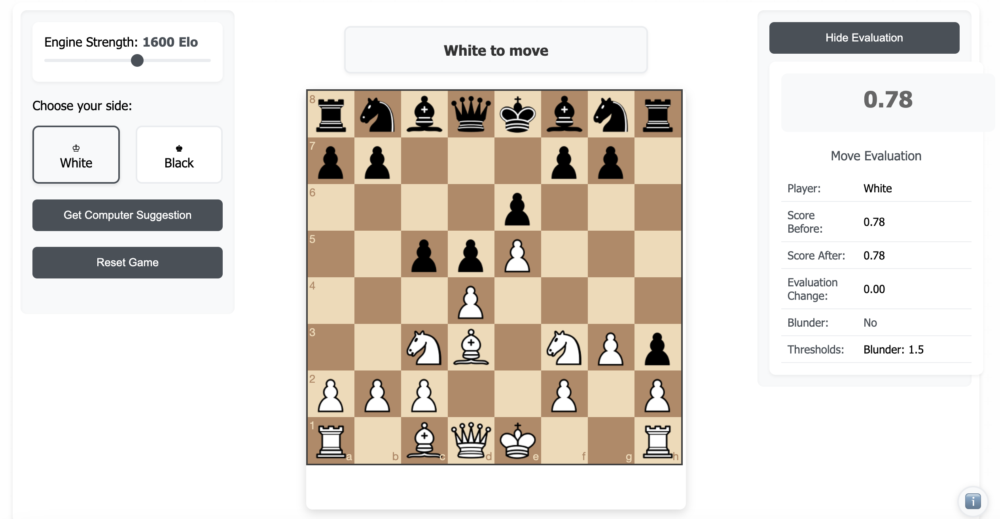

# Chess Trainer

A web-based chess training application that helps you improve your game by providing real-time feedback and analysis.

## Features

- Play against a chess engine with adjustable strength (600-2300 Elo rating)
- Real-time blunder detection with visual move suggestions
- Position evaluation and score tracking
- Responsive design for both desktop and mobile devices
- Undo functionality for learning from mistakes

## Screenshots
### Main Interface


### Blunder Detection


## Live Demo

[Play Chess Trainer](https://jiayang97.github.io/chess-trainer)

## Technologies Used

- HTML5, CSS3, JavaScript
- Chessboard.js for the chess interface
- Stockfish.js for chess engine analysis
- jQuery for DOM manipulation

## Local Development

1. Clone the repository:
```bash
git clone https://github.com/jiayang97/chess-trainer.git
```

2. Open `index.html` in your web browser

## Mobile Usage

The application is fully responsive and works well on mobile devices:
- The chess board automatically resizes to fit your screen
- Drag and drop pieces just like on desktop
- Toggle the evaluation panel to save space
- Info button is positioned in the bottom right for easy access

## License

MIT License - feel free to use and modify for your own projects!

## Contributing

Feel free to submit issues and enhancement requests!
